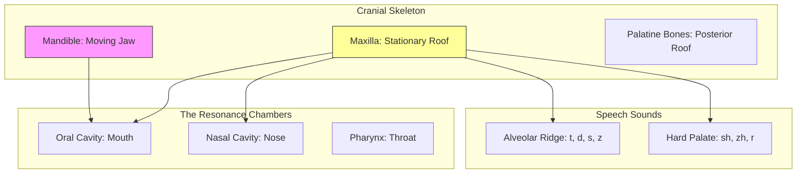

[← Back to Master Map](../)

# 🔬 Deep Dive 8: The Articulators (Skeleton)
**Textbook**: *Seikel (Chapter 6)*.
**Focus**: The static landscape of the vocal tract. The bones that form the "Filter."

> **SLP Note**: Cleft Palate occurs here. If the Maxilla (hard palate) doesn't fuse, the "Filter" is broken, and air escapes to the nose (Hypernasality).

---

## 1. The Mandible (Lower Jaw)
*   **Role**: The "Bus" that carries the passengers (Tongue & Lips).
*   **Movement**: Up/Down (speech), Rotary (chewing).
*   **Landmarks**:
    *   *Condylar Process*: The hinge (TMJ joint).
    *   *Mental Symphysis*: The chin fusion point.

## 2. The Maxilla (Upper Jaw)
*   **Role**: The stationary roof of the mouth.
*   **Palatine Process**: The front 3/4 of the Hard Palate.
*   **Alveolar Ridge**: The gummy ridge behind teeth (Source of /t/, /d/, /s/, /z/).

## 3. The Palatine Bones
*   **Role**: The back 1/4 of the Hard Palate.
*   **Significance**: Often the site of "Occult Submucous Clefts" (hidden clefts).

## 4. The Vomer ("The Plow")
*   **Role**: Forms the bottom half of the nasal septum (divides nose into Left/Right).
*   **Ethmoid Bone**: Forms the top half.

---

## 5. Summary Map

