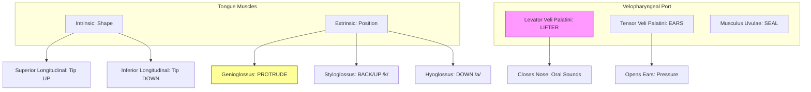

[← Back to Master Map](../)

# 🔬 Deep Dive 9: The Articulators (Muscles)
**Textbook**: *Seikel (Chapter 6)*.
**Focus**: The "Software" that changes the shape of the filter.

> **SLP Note**: The **Velum** (Soft Palate) is the single most important valve in speech. If it doesn't lift (Velopharyngeal Insufficiency), speech sounds nasal and unintelligible.

---

## 1. The Tongue
"The Primary Articulator." A muscular hydrostat (muscle wrapped in muscle).
### A. Intrinsic Muscles (Change SHAPE)
1.  **Superior Longitudinal**: Curves tip UP (/l/, /t/).
2.  **Inferior Longitudinal**: Curves tip DOWN.
3.  **Transverse**: Narrows & elongates (pulls sides in).
4.  **Vertical**: Flattens & broadens.

### B. Extrinsic Muscles (Change POSITION)
1.  **Genioglossus**: The HUGE prime mover. Protrudes tongue (sticks it out).
2.  **Styloglossus**: Pulls tongue UP & BACK (for /k/, /g/, /u/).
3.  **Hyoglossus**: Pulls tongue DOWN (for /a/).

## 2. The Velum (Soft Palate)
The trap door to the nose.
*   **Levator Veli Palatini**: The MAIN lifter. Closes off the nose for *oral* sounds (all vowels, p, b, t, d...).
*   **Musculus Uvulae**: Bunches up the velum to seal the gap tight. "Stiffens" the door.
*   **Tensor Veli Palatini**: Opens the Eustachian Tube (ears pop). Not a lifter.

## 3. The Pharynx (Throat Walls)
*   **Constrictors** (Superior, Middle, Inferior): Squeeze the tube (swallowing).
*   **Stylopharyngeus**: Widens the pharynx (yawning/resonance space).

---

## 4. Summary Map

